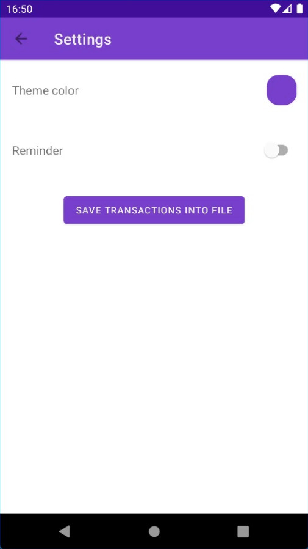
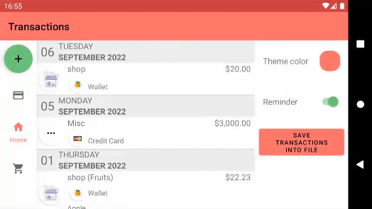

# My personal wallet

## Used Technologies

* Foreground Service 
* Graph with Fragments (Jetpack navigation). Master-details pattern  
* List of items with two types   
* Bottom Navigation 
* Night Theme
* Animation 
* Schedule task with WorkManager 
* Persistence: user preference in Shared Preferences and cached data in Room 
* Network calls REST  
* One screen with MVP. + RxJava 
* One screen with MVVM. + Coroutines, Flow, LiveData 
* Hilt for (DI) 
* Glide for image loading 
* One screen with Espresso UI tests 
* Firebase push 
* Crashlytics with Firebase 
* Obfuscation with R8 
* Created release build 

## Account and Category pages

|  |  |
| ---------------------------------------------- | ------------------------------------------- |

## Transactions page

|  |  |  |
| ---------------------------------------------- | ------------------------------------------- | ------------------------------------------- |

## Settings page

|  |  |  |
| ---------------------------------------------- | ------------------------------------------- | ------------------------------------------- |

## Miscellaneous (Dark theme, Landsacpe)

|  |  |
| ---------------------------------------------- | ------------------------------------------- |

